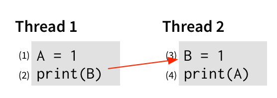
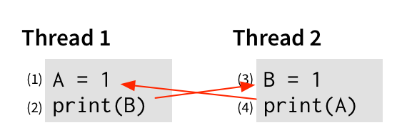
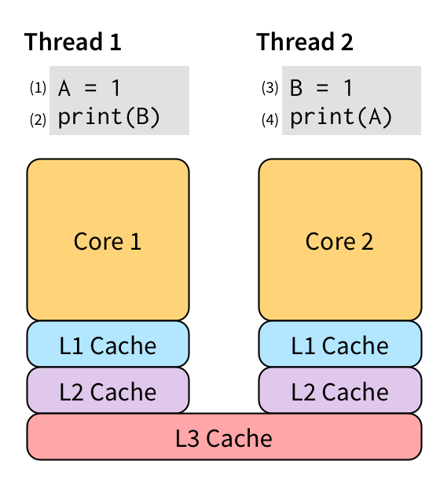
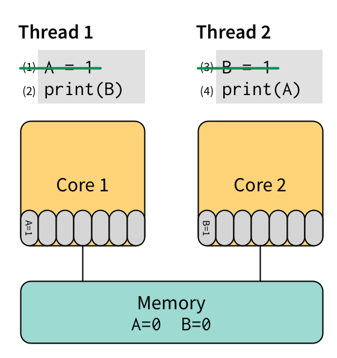

+++
date = 2016-02-17T09:00:00-08:00
draft = false
title = "Memory Consistency Models: A Tutorial"
[extra]
excerpt = "The cause of, and solution to, all your multicore performance problems."
+++

There are, of course, 
[only two hard things in computer science][fowler]: 
cache invalidation, naming things, and off-by-one errors.
But there is another hard problem 
lurking amongst the tall weeds of computer science:
*seeing things in order*.
Whether it be [sorting][bubblesort],
[un-sorting][fisheryates],
or [tweeting][distributed],
seeing things in order is a challenge for the ages.

One common ordering challenge is
*memory consistency*,
which is the problem of defining how parallel threads
can observe their shared memory state.
There are many resources on memory consistency,
but most are either [slides][kayvon]
(like [mine][myslides]!)
or [dense tomes][synthca].
My goal is to produce a primer,
and motivate why memory consistency is an issue for multicore systems.
For the details, you should certainly consult these other excellent sources.

## Making threads agree

Consistency models deal with 
how multiple threads (or workers, or nodes, or replicas, etc.)
see the world.
Consider this simple program, 
running two threads,
and where `A` and `B` are initially both `0`:

To understand what this program can output,
we should think about the order in which its events can happen.
Intuitively, there are two obvious orders in which this program could run:

* (1) → (2) → (3) → (4): The first thread runs both its events before the second thread, and so the program prints `01`.
* (3) → (4) → (1) → (2): The second thread runs both its events before the first thread. The program still prints `01`.

There are also some less obvious orders, where the instructions are interleaved with each other:

* (1) → (3) → (2) → (4): The first instruction in each thread runs before the second instruction in either thread, printing `11`.
* (1) → (3) → (4) → (2): The first instruction from the first thread runs, then both instructions from the second thread, then the second instruction from the first thread. The program still prints `11`.
* and a few others that have the same effect.

### Things that shouldn't happen

Intuitively, it shouldn't be possible for this program to print `00`. For line (2) to print `0`, we have to print `B` before line (3) writes a `1` to it. We can represent this graphically with an edge:

An edge from operation `x` to operation `y` says that `x` must *happen before* `y` to get the behavior we're interested in. Similarly, for line (4) to print `0`, that print must happen before line (1) writes a `1` to `A`, so let's add that to the graph:

And finally, of course, each thread's events should happen in order---(1) before (2), and (3) before (4)---because that's what we expect from an imperative program. So let's add those edges too:

But now we have a problem. If we start at (1), and follow the edges---to (2), then (3), then (4), then... (1) again! Remember that the edges are saying which events must happen before other events. So if we start at (1), and end up back at (1) again, the graph is saying that (1) must *happen before itself*! Barring a very concerning advance in physics, this is unlikely to be possible.

Since this execution would require time-warping, we can conclude that this program can't print `00`. Think of it as a [proof by contradiction][raa]: suppose this program *could* print `00`. Then all the ordering rules we just showed must hold. But those rules lead to a contradiction (event (1) happening before itself). So the assumption is false.

### Sequential consistency: an intuitive model of parallelism

Architects and programming language designers believe the rules we just explored to be *intuitive* to programmers. The idea is that multiple threads running in parallel are manipulating a single main memory, and so everything must happen in order. There's no notion that two events can occur "at the same time", because they are all accessing a single main memory.

Note that this rule says nothing about *what* order the events happen in---just that they happen in *some* order. The other part of this intuitive model is that events happen in *program order*: the events in a single thread happen in the order in which they were written. This is what programmers expect: all sorts of bad things would start happening if my programs were allowed to launch their missiles before checking that the key was turned.

Together, these two rules---a single main memory, and program order---define *sequential consistency*. [Defining sequential consistency][sc] is one of the many achievements that earned [Leslie Lamport][lamport] the [Turing award][turing] in 2013.[^lamport]

Sequential consistency is our first example of a *memory consistency model*. A memory consistency model (which we often just call a "memory model") defines the allowed orderings of multiple threads on a multiprocessor. For example, on the program above, sequential consistency *forbids* any ordering that results in printing `00`, but *allows* some orderings that print `01` and `11`.

A memory consistency model is a *contract* between the hardware and software. The hardware promises to only reorder operations in ways allowed by the model, and in return, the software acknowledges that all such reorderings are possible and that it needs to account for them.

## The problem with sequential consistency

One nice way to think about sequential consistency is as a switch. At each time step, the switch selects a thread to run, and runs its next event completely. This model preserves the rules of sequential consistency: events are accessing a single main memory, and so happen in order; and by always running the *next* event from a selected thread, each thread's events happen in program order.

The problem with this model is that it's *terribly, disastrously slow*. We can only run a single instruction at a time, so we've lost most of the benefit of having multiple threads run in parallel. Worse, we have to wait for each instruction to finish before we can start the next one---no more instructions can run until the current instruction's effects become *visible* to every other thread.

### Coherence

Sometimes, this requirement to wait makes sense. Consider the case where two threads both want to write to a variable `A` that another thread wants to read:

If we give up on the idea of a single main memory, to allow (1) and (2) to run in parallel, it's suddenly unclear which value of `A` event (3) should read. The single main memory guarantees that there will always be a "winner": a single last write to each variable. Without this guarantee, after both (1) and (2) have happened, (3) could see either `1` or `2`, which is confusing.

We call this guarantee *coherence*, and it says that all writes *to the same location* are seen in the same order by every thread. It doesn't prescribe the actual order (either (1) or (2) could happen first), but does require that everyone sees the same "winner".

## Relaxed memory models

Outside of coherence, a single main memory is often unnecessary. Consider this example again:

There's no reason why performing event (2) (a read from `B`) needs to wait until event (1) (a write to `A`) completes. They don't interfere with each other at all, and so should be allowed to run in parallel. Event (1) is particularly slow because it's a write. This means that with a single view of memory, we can't run (2) until (1) has become visible to every other thread. On a modern CPU, that's a very expensive operation due to the cache hierarchy: 

The only shared memory between the two cores is all the way back at the L3 cache, which often takes upwards of 90 cycles to access.

### Total store ordering (TSO)

Rather than waiting for the write (1) to become visible, we could instead place it into a *store buffer*:

Then (2) could start immediately after putting (1) into the store buffer, rather than waiting for it to reach the L3 cache. Since the store buffer is on-core, it's very fast to access. At some time in the future, the cache hierarchy will pull the write from the store buffer and propagate it through the caches so that it becomes visible to other threads. The store buffer allows us to hide the write latency that would usually be required to make write (1) visible to all the other threads.

Store buffering is nice because it preserves single-threaded behavior. For example, consider this simple single-threaded program:

The read in (2) needs to see the value written by (1) for this program to preserve the expected single-threaded behavior. Write (1) has not yet gone to memory---it's sitting in core 1's store buffer---so if read (2) just looks to memory, it's going to get an old value. But because it's running on the same CPU, the read can instead just inspect the store buffer directly, see that it contains a write to the location it's reading, and use that value instead. So even with a store buffer, this program correctly prints `1`.

A popular memory model that allows store buffering is called *total store ordering* (TSO). TSO mostly preserves the same guarantees as SC, except that it allows the use of store buffers. These buffers hide write latency, making execution [significantly faster][wbperf].

#### The catch

A store buffer sounds like a great performance optimization, but there's a catch: TSO allows behaviors that SC does not. In other words, programs running on TSO hardware can exhibit behavior that programmers would find surprising.

Let's look at the same first example from above, but this time running on a machine with store buffers. First, we execute (1) and then (3), which both place their data into the store buffer rather than sending it back to main memory:

Next we execute (2) on core 1, which is going to read the value of `B`. It first inspects its local store buffer, but there's no value of `B` there, so it reads `B` from memory and gets the value `0`, which it prints. Finally, we execute (4) on core 2, which is going to read the value of `A`. There's no value of `A` in core 2's store buffer, so it reads from memory and gets the value `0`, which it prints. At some indeterminate point in the future, the cache hierarchy empties both store buffers and propagates the changes to memory.

Under TSO, then, this program can print `00`. This is a behavior that we showed above to be explicitly ruled out by SC! So store buffers cause behaviors that programmers don't expect.

Is there any architecture willing to adopt an optimization that runs against programmer intuition? Yes! It turns out that practically *every* modern architecture includes a store buffer, and so has a memory model at least as weak as TSO.

In particular, the venerable x86 architecture specifies a memory model that is very close to TSO. Both Intel (the originator of x86) and AMD (the originator of x86-64) specify their memory model with example *litmus tests*, similar to the programs above, that describe the observable outcomes of small tests. Unfortunately, specifying the behavior of a complex system with a handful of examples leaves room for ambiguity. Researchers at Cambridge have poured significant effort into [formalizing x86-TSO][x86tso] to make clear the intended behaviors of x86's TSO implementation (and in particular, where it differs from this notion of store buffering).

### Getting weaker

Even though x86 gives up on sequential consistency, it's among the most well-behaved architectures in terms of the crazy behaviors it allows. Most other architectures implement even weaker memory models, meaning they allow even more unintuitive behaviors. There is an entire spectrum of such models---the [SPARC][] architecture allows programmer to *choose* between three different models at run time.

One such architecture worth calling out is [ARM][], which among other things, probably powers your smartphone. The ARM memory model is notoriously underspecified, but is essentially a form of *weak ordering*, which provides very few guarantees. Weak ordering allows almost any operation to be reordered, which enables a variety of hardware optimizations but is also a nightmare to program at the lowest levels.

### Escaping through barriers

Luckily, all modern architectures include synchronization operations to bring their relaxed memory models under control when necessary. The most common such operation is a *barrier* (or *fence*). A barrier instruction forces all memory operations before it to complete before any memory operation after it can begin. That is, a barrier instruction effectively reinstates sequential consistency at a particular point in program execution.

Of course, this is exactly the behavior we were trying to avoid by introducing store buffers and other optimizations. Barriers are an escape hatch to be used sparingly: they can cost hundreds of cycles. They are also extremely subtle to use correctly, especially when combined with ambiguous memory model definitions. There are some more usable primitives, such as [atomic compare-and-swap][cas], but using low-level synchronization directly should really be avoided. A real synchronization library will spare you worlds of pain.

## Languages need memory models too

It's not only hardware that reorders memory operations---compilers do it all the time. Consider this program:

    X = 0
    for i in range(100):
        X = 1
        print X

This program always prints a string of 100 `1`s. Of course, the write to `X` inside the loop is redundant, because no other code changes the value of `X`. A standard [loop-invariant code motion][licm] compiler pass will move the write outside the loop to avoid repeating it, and [dead store elimination][dse] will then remove `X = 0`, leaving:

    X = 1
    for i in range(100):
        print X

These two programs are totally equivalent, in that they will both produce the same output.[^compiler]

But now suppose there's another thread running in parallel with our program, and it performs a single write to `X`:

    X = 0

With these two threads running in parallel, the first program's behavior changes:
now, it can print strings like `11101111...`, so long as there's only a single
zero (because it will reset `X=1` on the next iteration).
The second program's behavior also changes:
it can now print strings like `11100000...`,
where once it starts printing zeroes it never goes back to ones.

But these two changes behaviors are not common to the two programs:
the first program can never print `11100000...`,
nor can the second program ever print `11101111...`.
This means that in the presence of parallelism,
the compiler optimization no longer produces an equivalent program!

What this example is suggesting is that there's also an idea of memory consistency at the program level.
The compiler optimization here is effectively a reordering: it's rearranging (and removing some) memory accesses in ways that may or may not be visible to programmers.
So to preserve intuitive behavior, programming languages need memory models of their own, to provide a contract to programmers about how their memory operations will be reordered.
This idea is becoming more common in the language design community. For example, the latest versions of [C++][c11mm] and [Java][jmm] have rigorously-defined memory models governing their operations.

## Computers are broken!

All this reordering seems crazy insane, and there's no way a human can keep it all straight.
On the other hand, if you reflect on your programming experience, memory consistency is probably not an issue you've run into often, if at all (unless you're a low-level kernel hacker).
How do I reconcile these two extremes?

The trick is that every example I've mentioned here has involved a *data race*.
A data race is two accesses to the same memory location, of which at least one is a write operation,
and with no ordering induced by synchronization.
If there are no data races, then the reordering behaviors don't matter,
because all unintuitive reorderings will be blocked by synchronization.
Note that this doesn't mean race-free programs are *deterministic*: different threads can win the races on each execution.

In fact, languages such as C++ and Java offer a guarantee known as *sequential consistency for data-race-free programs* (or the buzzwordy version, "SC for DRF").
This guarantee says that if your program has no data races, the compiler will insert all the necessary fences to preserve the appearance of sequential consistency.
If your program *does* have data races, however, all bets are off, and the compiler is free to do whatever it likes.
The intuition is that programs with data races are quite likely to be buggy, and there's no need to provide strong guarantees for such buggy programs. If a program has deliberate data races, the programmer likely knows what they're doing anyway, and so can be responsible for memory ordering issues themselves.

## Use a synchronization library

Now that you've seen all this mess, the most important lesson is that you should use a synchronization library. It will take care of ugly reordering issues for you. Operating systems are also pretty heavily optimized to have only the synchronization necessary on a particular platform. But now you know what's going on under the hood when these libraries and kernels deal with subtle synchronization issues.

If, for some reason, you want to know more about the various abominable memory models computer architecture has inflicted on the world, the Morgan & Claypool synthesis lectures on computer architecture have [a nice entry][synthca] on memory consistency and coherence.

[^lamport]: Though Lamport was originally writing about multiprocessors, his later work has moved toward distributed systems. In the modern distributed systems context, "sequential consistency" means something slightly different (and weaker) than what architects intend. What architects call "sequential consistency" is more like what distributed systems folks would call "linearizability".
[^compiler]: Let's suspend disbelief for a moment and assume the compiler isn't smart enough to optimize this program into a single call to `print`.

[fowler]: http://martinfowler.com/bliki/TwoHardThings.html
[bubblesort]: https://en.wikipedia.org/wiki/Bubble_sort
[fisheryates]: https://en.wikipedia.org/wiki/Fisher%E2%80%93Yates_shuffle
[distributed]: https://twitter.com/mathiasverraes/status/632260618599403520
[lucia]: https://github.com/blucia0a/Talks/blob/master/Other/ConsistencySlides.pdf?raw=true
[kayvon]: http://15418.courses.cs.cmu.edu/spring2015/lecture/consistency
[myslides]: http://courses.cs.washington.edu/courses/cse451/15au/notes/l17-mcm-slides.pdf
[synthca]: http://www.morganclaypool.com/doi/abs/10.2200/S00346ED1V01Y201104CAC016
[raa]: https://en.wikipedia.org/wiki/Proof_by_contradiction
[sc]: http://research.microsoft.com/en-us/um/people/lamport/pubs/multi.pdf
[lamport]: http://www.lamport.org/
[turing]: http://amturing.acm.org/
[wbperf]: https://courses.engr.illinois.edu/cs533/reading_list/2b.pdf
[x86tso]: https://www.cl.cam.ac.uk/~pes20/weakmemory/cacm.pdf
[SPARC]: https://en.wikipedia.org/wiki/SPARC
[ARM]: https://en.wikipedia.org/wiki/ARM_architecture
[cas]: https://en.wikipedia.org/wiki/Compare-and-swap
[licm]: https://en.wikipedia.org/wiki/Loop-invariant_code_motion
[dse]: https://en.wikipedia.org/wiki/Dead_store
[c11mm]: https://cseweb.ucsd.edu/classes/fa13/cse160-a/Lectures/Lec07.pdf
[jmm]: http://www.cs.umd.edu/~pugh/java/memoryModel/
